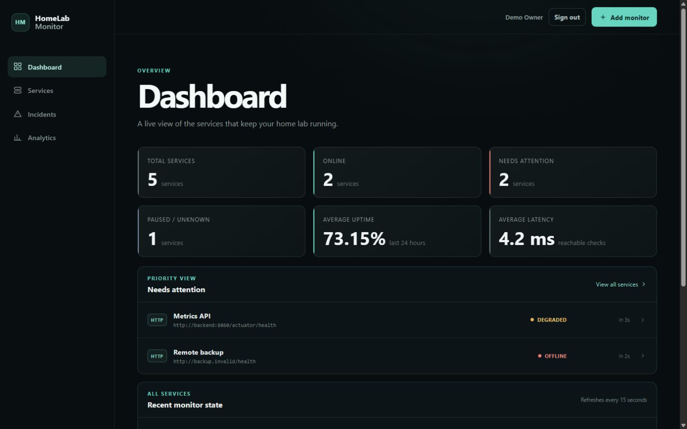
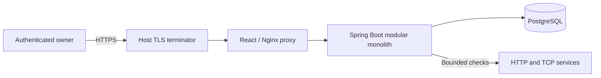
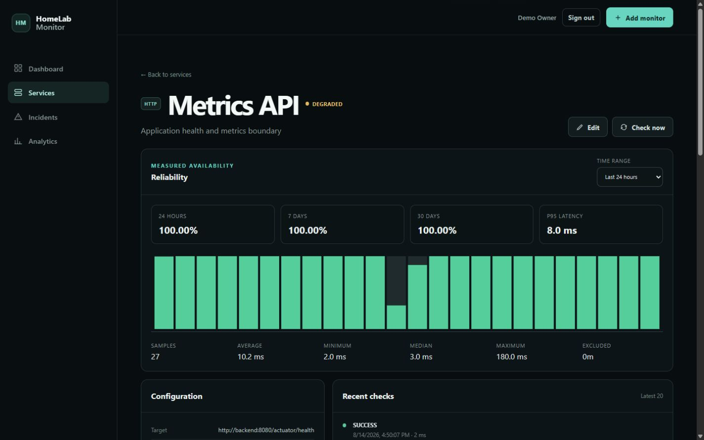
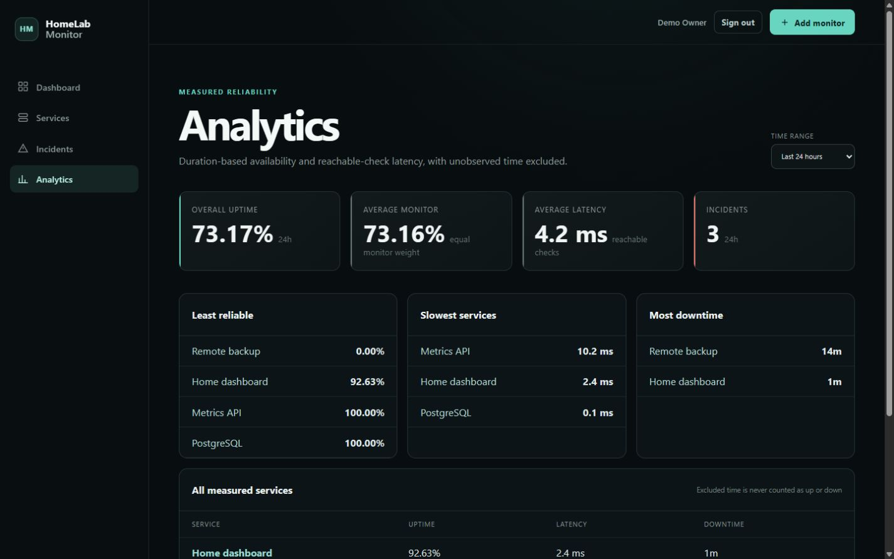
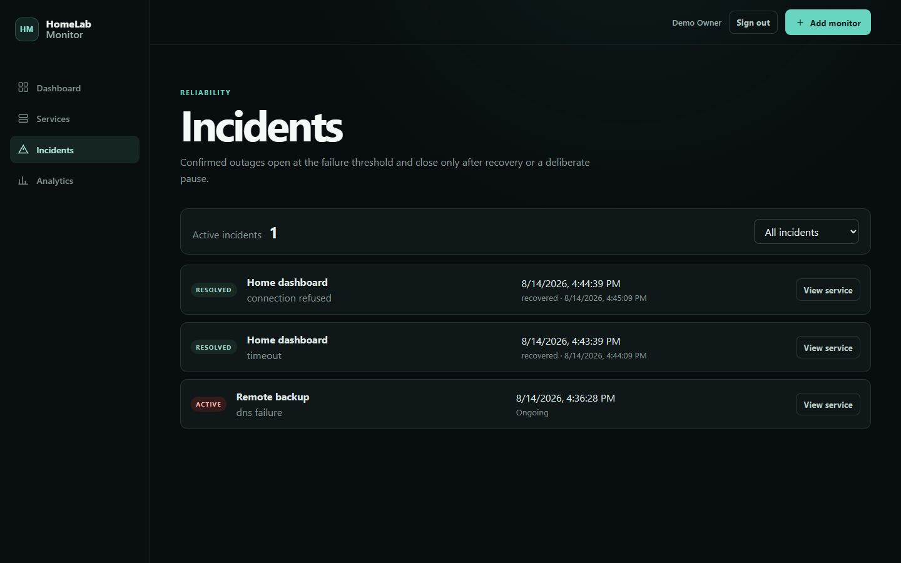
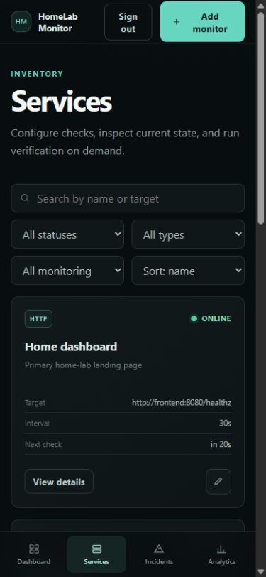

# HomeLab Monitor

[](https://github.com/AlbinoPriest/homelab-monitor/actions/workflows/ci.yml)
[](LICENSE)

HomeLab Monitor is a self-hosted availability, latency, reliability, and incident dashboard for HTTP/HTTPS
and TCP services on a home network. It is a single-owner application designed for one host and roughly 100
monitors, with no external monitoring service required.



## What it does

- Runs bounded scheduled and manual HTTP/HTTPS or TCP checks.
- Tracks authoritative `UNKNOWN`, `ONLINE`, `DEGRADED`, `OFFLINE`, and `PAUSED` states.
- Applies configurable failure and recovery thresholds and records exactly one incident per confirmed outage.
- Calculates duration-based uptime with unobserved and paused time explicitly excluded.
- Reports 1-hour, 24-hour, 7-day, and 30-day reliability and latency analytics.
- Pushes authenticated post-commit change notifications through Server-Sent Events.
- Protects all monitor operations behind singleton-owner session authentication and CSRF validation.
- Deploys the frontend proxy, Spring Boot backend, and PostgreSQL with Docker Compose.

## Engineering highlights

- Network checks run outside database transactions; accepted results are version-checked and persisted with
  status, history, incident, and schedule changes in one locked transaction.
- Observation-validity boundaries are stored with each check. Analytics intersects state history with that
  evidence instead of treating monitoring gaps as uptime or downtime.
- Private targets are intentionally supported, so configuration is privileged and HTTP redirects, response
  reads, DNS, transport timeouts, and error output are bounded defensively.
- Realtime messages are invalidation hints rather than a second state store. Reconnects refetch authoritative
  API data and session destruction terminates associated streams.
- Production exposes only an unprivileged loopback Nginx proxy. The backend and non-superuser application
  database role remain private inside the Compose topology.

## Architecture



The backend is a feature-oriented modular monolith covering authentication, monitoring, incidents, analytics,
and realtime delivery. PostgreSQL and Flyway own durable state and schema evolution. See
[the architecture guide](docs/ARCHITECTURE.md) and [decision records](docs/adr/README.md).

## Production quick start

Prerequisites are a Linux host with Docker Engine, Docker Compose v2, a DNS name, and a trusted HTTPS
terminator such as Caddy.

Before starting the stack, restrict the HTTPS origin to the operator so nobody else can reach first-owner setup.
Keep that restriction in place until the singleton owner is created and a login is verified. The complete
trust-boundary procedure is in [the deployment guide](docs/DEPLOYMENT.md#first-production-start).

```bash
cp .env.production.example .env
# Set different long random values for POSTGRES_ADMIN_PASSWORD and APP_DB_PASSWORD.
chmod 600 .env
docker compose config --quiet
docker compose up -d --build
docker compose ps
```

Then run `sh scripts/smoke-production.sh https://monitor.example.net`. The complete setup, TLS assumptions,
configuration, backup, restore, upgrade, and rollback procedures are in [docs/DEPLOYMENT.md](docs/DEPLOYMENT.md).

## Technology

| Area | Stack |
| --- | --- |
| Backend | Java 21, Spring Boot 4.1, Spring Security, Spring Data JPA, Maven |
| Frontend | React 19, TypeScript 6, Vite 8, TanStack Query, Recharts |
| Data | PostgreSQL 17, Flyway |
| Deployment | Docker Compose, unprivileged Nginx, pinned production image digests |
| Verification | JUnit, Testcontainers, Vitest, Testing Library, GitHub Actions |

## Screenshots

All screenshots use fictional services in an isolated local deployment.

<table>
  <tr>
    <td></td>
    <td></td>
  </tr>
  <tr>
    <td></td>
    <td align="center"></td>
  </tr>
</table>

## Development and verification

Development runs PostgreSQL in Docker while the backend and Vite frontend run locally. Follow the Windows or
POSIX instructions in [docs/DEPLOYMENT.md](docs/DEPLOYMENT.md), then run the relevant
checks:

```bash
cd backend && ./mvnw verify
cd ../frontend && npm ci && npm run lint && npm test && npm run build && npm run format:check
cd .. && docker compose -f docker-compose.dev.yml config --quiet
```

The backend suite uses disposable Testcontainers PostgreSQL instances and deterministic local HTTP/TCP test
servers; it does not depend on a real home network or public service.

## Security and scope

Monitor configuration can intentionally reach private-network targets and must be treated as privileged.
Never publish the backend or database ports, expose first-owner setup before claiming it, or reuse the checked-in
development credentials. Read [SECURITY.md](SECURITY.md) before changing authentication, target execution, proxy,
or deployment boundaries.

Version 1 deliberately excludes multi-user access, notifications, public status pages, remote agents, ICMP,
SNMP, and vendor-specific integrations. Those remain [roadmap items](docs/PROJECT_SPEC.md#roadmap-not-version-1).

## Contributing and license

See [CONTRIBUTING.md](CONTRIBUTING.md) for the review and verification contract. HomeLab Monitor is licensed
under the [MIT License](LICENSE).
