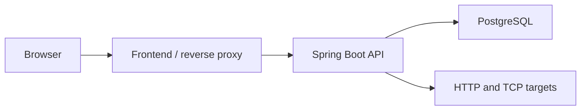

# HomeLab Monitor

HomeLab Monitor is a self-hosted application for tracking the availability, latency, reliability, and incidents of HTTP/HTTPS and TCP services on a home network.

> [!IMPORTANT]
> The repository is at the Phase 0 bootstrap checkpoint. Product code and runnable containers begin in Phase 1; the capabilities below describe the version 1 target and are not yet implemented.

## Version 1 scope

- Generic HTTP/HTTPS monitoring with expected-status and latency checks
- Generic TCP connectivity and connection-latency monitoring
- A centralized `UNKNOWN`, `ONLINE`, `DEGRADED`, `OFFLINE`, and `PAUSED` state model
- Failure and recovery thresholds with incident tracking
- Duration-based uptime and bounded observation-freshness semantics
- Single-owner setup with session authentication
- A dark-mode-first React dashboard with service, incident, and analytics views
- Docker Compose deployment for the frontend, backend, and PostgreSQL

Vendor-specific integrations, notifications, public status pages, and multi-user access are roadmap items rather than version 1 requirements.

## Planned architecture

HomeLab Monitor will be a modular monolith: a Spring Boot backend, React frontend, and PostgreSQL database deployed as three Docker Compose services. This keeps deployment simple while preserving clear feature boundaries.



See [docs/ARCHITECTURE.md](docs/ARCHITECTURE.md) for design constraints and decisions.

## Repository layout

```text
backend/           Spring Boot application (Phase 1)
frontend/          React application (Phase 1)
docs/              Product, architecture, deployment, and ADR documentation
.codex/            Project-scoped Codex and reviewer configuration
.github/           Contribution templates
```

## Development status

Phase 0 is complete when the bootstrap branch contains durable project instructions, architecture and deployment skeletons, contribution templates, and validated Codex agent configuration. No application build commands are available until Phase 1 creates the Maven and npm projects.

The authoritative requirements and phase status live in [docs/PROJECT_SPEC.md](docs/PROJECT_SPEC.md).

## Security model

HomeLab Monitor is intentionally allowed to contact private network targets. That capability creates an SSRF risk if untrusted people can configure monitors, so version 1 uses a single authenticated owner, strict protocol and target validation, bounded redirects and response reads, and safe error reporting. See [SECURITY.md](SECURITY.md).

## Contributing

Read [CONTRIBUTING.md](CONTRIBUTING.md) and [AGENTS.md](AGENTS.md) before making changes. Documentation must describe working behavior truthfully; planned behavior must remain clearly labeled.

## License

Licensed under the [MIT License](LICENSE).
