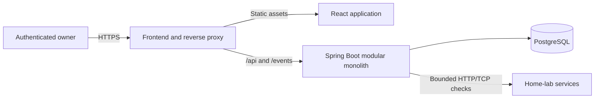
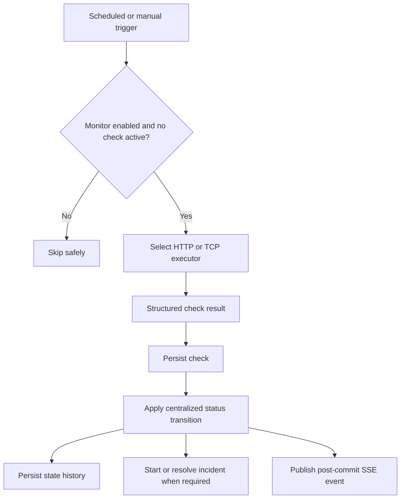

# Architecture

This document records durable constraints and the current design. The monitoring core, management interface, and Phase 4 owner authentication are implemented; sections marked **Planned** describe later phases.

## Implemented foundation

- The Java 21/Spring Boot modular monolith starts with Spring MVC, Data JPA, Validation, Security, Actuator, and development-only OpenAPI support.
- PostgreSQL is the application database. Flyway owns schema evolution and Hibernate uses `ddl-auto=validate`; domain migrations begin with Phase 2.
- The React/TypeScript application uses Vite, React Router, and TanStack Query. The dashboard and service-management routes consume the versioned monitor APIs through the same-origin development proxy.
- Development runs PostgreSQL in Docker Compose while backend and frontend run directly. Production container topology remains Phase 8 work.
- A singleton owner is created through first-run setup and authenticated with a server-side Spring Security session. All monitor APIs require that owner; setup, login, auth status, CSRF bootstrap, and health remain public. Mutations require CSRF protection, while loopback binding and Host validation remain defense in depth for development.

## Frontend application

The Phase 3 UI treats the backend monitor status as authoritative. TanStack Query owns server state and
invalidates monitor, check, and history queries after mutations; the frontend does not predict status
transitions. React Router provides dashboard, service inventory, and service-detail routes. The inventory
performs local search, status filtering, and sorting because the version 1 design target is approximately
100 monitors.

Forms adapt between HTTP and TCP fields and share the backend's documented bounds. Deliberate mutations
show inline success or safe error feedback, destructive deletion requires confirmation, dialogs restore
focus and close with Escape, and all status presentations retain a text label at every breakpoint.
Incident, uptime, and latency analytics are intentionally not fabricated from raw check counts; their UI
surfaces remain deferred until the authoritative Phase 5/6 APIs exist.

Before rendering application routes, the frontend resolves authentication status and presents either the
one-time owner setup or login form. A successful setup signs the owner in. A protected API `401` refreshes
the authentication gate, and logout clears both the server session and cached client state.

## System context — planned

HomeLab Monitor is a single-instance modular monolith sized for roughly 100 monitors.

Docker Compose will run the proxy/frontend, backend, and database. Only the proxy/frontend should be public in production; PostgreSQL remains internal.

## Backend module direction

The implemented `monitor` feature owns monitor configuration, execution, scheduling, checks, and state history. Later phases add `auth`, `user`, `incident`, `analytics`, and `realtime`; `common` remains small. Modules expose narrow application-facing services and avoid a mechanical enterprise layering scheme. A notification module must not exist until notifications are implemented.

Controllers exchange DTOs, application services own use-case/transaction boundaries, and persistence entities remain internal. The backend owns all status and incident decisions.

## Monitor execution

Phase 2 uses a bounded scheduled worker pool (8 threads, queue capacity 92) and a JVM-local atomic in-flight set keyed by monitor UUID. Manual checks use a separate four-thread, zero-queue executor, so they start immediately or return `409` without waiting behind scheduled work. The coordinator claims a monitor before work enters either pool, so scheduled/manual collisions return or skip without overlapping network work. There is no permanent thread per monitor and no distributed lock because version 1 is single-instance.

Network execution occurs outside a database transaction. It captures the monitor's optimistic version, then completion obtains a pessimistic row lock and accepts the result only when the row still exists, remains enabled, and has the same version. This serializes competing transitions and discards stale results after configuration changes, pause, or delete. Persisting the check, state counters, transition history, and next due time is one transaction.

`next_check_at` is persisted. A restart loses only the ephemeral in-flight set; overdue enabled monitors are discovered again. Interval updates set the next check due immediately under the new configuration. Shutdown waits up to 35 seconds for workers, while monitor timeouts are bounded at 30 seconds.

## State and availability semantics — required

- `ONLINE`: reachable and meets expectations.
- `DEGRADED`: reachable but exceeds the configured latency warning threshold.
- `OFFLINE`: confirmed failed after the failure threshold.
- `PAUSED`: deliberately disabled; excluded from scheduling and uptime.
- `UNKNOWN`: current observation evidence is insufficient; excluded from uptime.

Reachable results reset failure progress. While offline, consecutive reachable results satisfy recovery and resolve to online or degraded based on the latest result. Pausing resolves an active incident as `MONITORING_PAUSED`; normal threshold recovery uses `RECOVERED`. Re-enable always returns to unknown.

Uptime is derived from state durations, never check counts. Online/degraded durations are available, offline durations unavailable, and paused/unknown durations excluded.

## Observation freshness — decision deferred to implementation phase

Phase 5/6 must choose and test a deterministic freshness formula based on interval, timeout, and scheduler tolerance. Reachable state cannot be carried indefinitely after observations stop.

The offline rule needs architecture review because blindly expiring a confirmed outage can hide it, while carrying it through monitor-process downtime can fabricate downtime. The implementation must preserve confirmed incident facts but represent unobserved intervals honestly. The chosen transition and restart reconstruction rules must be documented here before Phase 6 is complete.

## Security boundaries

The owner can intentionally monitor private network services. Therefore target fetching is a privileged feature, not a public URL-preview service.

- Only the authenticated owner may configure or trigger monitors after setup.
- HTTP accepts only absolute `http` and `https` URLs without user information or fragments, manually follows at most three redirects, revalidates each destination, closes response streams without retaining bodies, and enforces an overall timeout.
- TCP validates host, port, and timeout and uses Java socket APIs directly. DNS resolution runs on a separate two-thread bounded pool and shares the check's end-to-end deadline, so a slow system resolver cannot consume the monitor worker pool indefinitely.
- No target input reaches a shell.
- API errors and logs omit secrets and internal exception details.
- Session cookies, CSRF, CORS/same-origin behavior, Actuator exposure, and reverse-proxy headers require dedicated review in Phases 4 and 8.

Private IP addresses remain allowed by design. Monitor reads, configuration, and manual execution are owner-only. The backend also binds to `127.0.0.1` and accepts only `localhost`, `127.0.0.1`, and `[::1]` Host headers by default, preventing browser DNS-rebinding access during development. `SERVER_ADDRESS` and matching `ALLOWED_HOSTS` values are explicit opt-in overrides for trusted remote development only.

The database enforces exactly one owner. Email addresses are normalized, passwords are BCrypt-hashed at
strength 12, and setup races fail closed. Authentication rotates an existing session identifier; logout
invalidates the session. The session cookie is HttpOnly, SameSite=Lax, expires after 30 minutes of
inactivity by default, and must be configured Secure when served through production HTTPS.
Login attempts are bounded over a rolling one-minute window globally and by direct source address and
normalized account. Throttling returns a generic `429` with `Retry-After` and expires without permanent
lockout. Phase 8 must explicitly define trusted reverse-proxy source-address handling before production.

## Data and migrations

PostgreSQL is authoritative. Flyway is active from Phase 1 and performs incremental migrations; Hibernate validates rather than creates schema. The empty foundation schema intentionally has no placeholder migration. Phase 2 introduces the first domain migration. State history will provide authoritative transition intervals, while checks provide observation and latency detail. Time-window queries will be indexed and bounded. Raw checks will have configurable scheduled retention.

## Real-time delivery — planned

SSE is preferred because updates are server-to-browser and do not require bidirectional WebSockets. Events should describe current changes rather than replaying large histories. Authentication, reconnection, transaction timing, and cleanup require tests in Phase 7 and a concise ADR when the decision is finalized.

## Decision records

- [ADR-0001: Use a modular monolith](adr/0001-use-a-modular-monolith.md)

Add ADRs only for decisions with meaningful alternatives and consequences.
