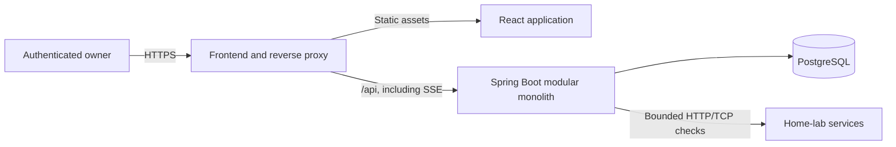
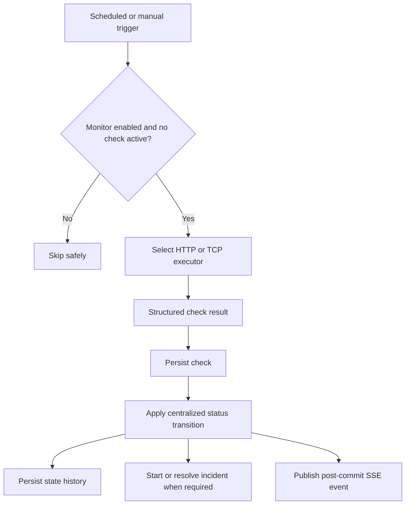

# Architecture

This document records durable constraints and the current design. The monitoring core, management interface,
owner authentication, incident/reliability behavior, analytics, authenticated realtime delivery, and production
container topology are implemented; sections marked **Planned** describe later phases.

## Implemented foundation

- The Java 21/Spring Boot modular monolith starts with Spring MVC, Data JPA, Validation, Security, Actuator, and development-only OpenAPI support.
- PostgreSQL is the application database. Flyway owns schema evolution and Hibernate uses `ddl-auto=validate`; domain migrations begin with Phase 2.
- The React/TypeScript application uses Vite, React Router, and TanStack Query. The dashboard and service-management routes consume the versioned monitor APIs through the same-origin development proxy.
- Development runs PostgreSQL in Docker Compose while backend and frontend run directly. Production uses
  unprivileged frontend and backend images plus PostgreSQL, with health-ordered startup and bounded resources.
- A singleton owner is created through first-run setup and authenticated with a server-side Spring Security session. All monitor APIs require that owner; setup, login, auth status, CSRF bootstrap, and health remain public. Mutations require CSRF protection, while loopback binding and Host validation remain defense in depth for development.

## Frontend application

The Phase 3 UI treats the backend monitor status as authoritative. TanStack Query owns server state and
invalidates monitor, check, and history queries after mutations; the frontend does not predict status
transitions. React Router provides dashboard, service inventory, and service-detail routes. The inventory
performs local search, status filtering, and sorting because the version 1 design target is approximately
100 monitors.

Forms adapt between HTTP and TCP fields and share the backend's documented bounds. Deliberate mutations
show inline success or safe error feedback, destructive deletion requires confirmation, dialogs restore
focus and close with Escape, and all status presentations retain a text label at every breakpoint.
Incident history is rendered from the authoritative incident API. The service detail and analytics routes
consume duration-based uptime and reachable-check latency APIs. The reliability chart uses 24 bounded buckets,
and the UI labels retention-limited ranges rather than presenting missing coverage as uptime or downtime.
An authenticated `EventSource` receives compact monitor-change notifications and invalidates only the affected
TanStack Query families. Every initial connection and automatic reconnect also refetches mounted authoritative
queries, closing the no-replay gap without making the frontend predict state transitions.

Before rendering application routes, the frontend resolves authentication status and presents either the
one-time owner setup or login form. A successful setup signs the owner in. A protected API `401` refreshes
the authentication gate, and logout clears both the server session and cached client state.

## System context

HomeLab Monitor is a single-instance modular monolith sized for roughly 100 monitors.



Docker Compose runs the proxy/frontend, backend, and database. Only the unprivileged frontend publishes a
loopback host port; a host-managed TLS terminator provides the browser origin. Backend traffic crosses the
edge network, PostgreSQL is isolated on an internal data network, and the backend retains outbound edge access
for monitor checks. See [ADR-0003](adr/0003-use-a-loopback-production-proxy.md).

PostgreSQL initialization uses a dedicated administrative role. A first-start script creates a separate
non-superuser application role with access only to the application database and schema; Spring and Flyway
receive only that restricted role. The initial owner must be created while the HTTPS origin is limited to the
operator's source, because setup necessarily remains public until the singleton owner row exists.

## Backend module direction

The implemented `monitor` feature owns monitor configuration, execution, scheduling, checks, state history, freshness, raw-check cleanup, and compact domain-change events. `auth` owns the singleton owner/session boundary, `incident` owns outage lifecycle and queries, `analytics` owns read-only duration/latency aggregation, and `realtime` converts committed domain changes into authenticated SSE notifications. `common` remains small. Modules expose narrow application-facing services and avoid a mechanical enterprise layering scheme. A notification module must not exist until notifications are implemented.

Controllers exchange DTOs, application services own use-case/transaction boundaries, and persistence entities remain internal. The backend owns all status and incident decisions.

## Monitor execution



Scheduled checks use a bounded 50-thread worker pool with queue capacity 50, enough to process the documented
100-monitor envelope within one minute even when every target consumes the 30-second timeout. Manual checks use
a separate four-thread, zero-queue executor, so they start immediately or return `409` without waiting behind
scheduled work. Their global start rate is bounded to ten per second and excess requests return `429`. The
coordinator claims a monitor before work enters either pool, so scheduled/manual collisions return or skip without
overlapping network work. There is no permanent thread per monitor and no distributed lock because version 1 is
single-instance.

Monitor intervals are bounded from one minute through 24 hours. At the version 1 target of roughly 100
monitors, the minimum interval limits raw-check growth to 144,000 rows per day and keeps 30-day analytics
queries within the documented single-instance capacity envelope.

Network execution occurs outside a database transaction. It captures the monitor's optimistic version, then completion obtains a pessimistic row lock and accepts the result only when the row still exists, remains enabled, and has the same version. This serializes competing transitions and discards stale results after configuration changes, pause, or delete. Persisting the check, state counters, transition history, and next due time is one transaction.

`next_check_at` is persisted. A restart loses only the ephemeral in-flight set; overdue enabled monitors are discovered again. Interval updates set the next check due immediately under the new configuration. Shutdown allows 65 seconds for the scheduled pool's two timeout-bound waves, while individual monitor timeouts are bounded at 30 seconds.

## State and availability semantics — required

- `ONLINE`: reachable and meets expectations.
- `DEGRADED`: reachable but exceeds the configured latency warning threshold.
- `OFFLINE`: confirmed failed after the failure threshold.
- `PAUSED`: deliberately disabled; excluded from scheduling and uptime.
- `UNKNOWN`: current observation evidence is insufficient; excluded from uptime.

Reachable results reset failure progress. While offline, consecutive reachable results satisfy recovery and resolve to online or degraded based on the latest result. Pausing resolves an active incident as `MONITORING_PAUSED`; normal threshold recovery uses `RECOVERED`. Re-enable always returns to unknown.

Exactly one active incident may exist per monitor. It opens in the same locked transaction that first
transitions the monitor to offline. Repeated failures do not duplicate it. Enabled configuration changes
preserve a confirmed offline state and reset recovery progress, so they cannot orphan the incident or
bypass its recovery threshold. Deleting a monitor cascades its incident history.

Uptime is derived from state durations, never check counts. Online/degraded durations are available, offline durations unavailable, and paused/unknown durations excluded. State intervals are intersected with merged persisted observation-validity coverage, so time without fresh evidence remains excluded even if the operational status or active incident is still offline.

## Observation freshness

Each accepted check persists `last_checked_at` and the calculated validity boundary on both the check and
monitor. Keeping the boundary with historical checks prevents later configuration edits from changing the
meaning of past observation windows. A reachable `ONLINE` or `DEGRADED` observation expires at:

```text
last checked + monitor interval + monitor timeout + max(5 seconds, 2 × scheduler scan delay)
```

Queued work is tracked separately from running work, so queued checks neither overlap nor suppress freshness.
The scanner claims the same per-monitor running gate as an executing check and obtains the same pessimistic
monitor lock used by completion before moving stale reachable state to `UNKNOWN`, recording the transition at
the computed expiry instant rather than the later scan time.
Check completion performs the same expiry reconciliation under that lock before applying a new result. This
preserves a real unobserved gap after a restart or a delayed worker even when the new check wins the lock; the
newly completed check then establishes fresh state again.

Expiry also clears incomplete threshold evidence: `UNKNOWN` failure progress and `OFFLINE` recovery progress
cannot bridge an unobserved gap. The confirmed offline status and its active incident remain intact; only a
fresh consecutive recovery sequence may resolve them.

For checks created before this boundary was persisted, the Phase 5 migration uses `checked_at` itself as the
validity boundary. This deliberately treats legacy coverage as unknown instead of retrospectively guessing
from a monitor's current configuration or today's scheduler tolerance.

A confirmed `OFFLINE` state does not expire automatically: doing so would hide a known unresolved outage
and could bypass its recovery threshold. Its incident remains active until threshold recovery or pause.
Duration metrics nevertheless cap observed outage contribution at persisted freshness boundaries and
report later unobserved intervals as excluded rather than fabricating downtime. This separates the
operational fact “recovery has not been observed” from claims about availability while the monitor was not
running.

## Security boundaries

The owner can intentionally monitor private network services. Therefore target fetching is a privileged feature, not a public URL-preview service.

- Only the authenticated owner may configure or trigger monitors after setup.
- HTTP accepts only absolute `http` and `https` URLs without user information or fragments, manually follows at most three redirects, revalidates each destination, closes response streams without retaining bodies, and enforces an overall timeout.
- TCP validates host, port, and timeout and uses Java socket APIs directly. DNS resolution runs on a separate bounded pool sized for all scheduled and manual worker lanes and shares the check's end-to-end deadline, so a slow system resolver cannot consume the monitor worker pool indefinitely or reject a supported-capacity wave.
- No target input reaches a shell.
- API errors and logs omit secrets and internal exception details.
- Session cookies, CSRF, CORS/same-origin behavior, Actuator exposure, and reverse-proxy headers are part of the
  authenticated single-origin boundary and production review surface.

Private IP addresses remain allowed by design. Monitor reads, configuration, and manual execution are owner-only. The backend also binds to `127.0.0.1` and accepts only `localhost`, `127.0.0.1`, and `[::1]` Host headers by default, preventing browser DNS-rebinding access during development. `SERVER_ADDRESS` and matching `ALLOWED_HOSTS` values are explicit opt-in overrides for trusted remote development only.

The database enforces exactly one owner. Email addresses are normalized, passwords are BCrypt-hashed at
strength 12, and setup races fail closed. Authentication rotates an existing session identifier; logout
invalidates the session. The session cookie is HttpOnly, SameSite=Lax, expires after 30 minutes of
inactivity by default, and is unconditionally Secure in the production profile.
Login attempts are bounded over a rolling one-minute window globally and by direct source address and
normalized account. Throttling returns a generic `429` with `Retry-After` and expires without permanent
lockout. Development ignores forwarding headers. In production, the host TLS terminator overwrites
`X-Forwarded-For`; the isolated frontend accepts only one IP-shaped value from that trusted hop, falls back to
its immediate peer otherwise, and overwrites `X-Real-IP` for the backend. The backend validates one IP literal
from that header. This trust is valid only because the frontend listener is restricted to the TLS proxy, the
backend is unpublished, and the edge network must not contain untrusted containers.

The frontend proxy fixes the internal `Host` value, disables SSE buffering, bounds proxy timeouts and request
body size, and supplies CSP, clickjacking, MIME-sniffing, referrer, permissions, and HSTS headers. The backend
and database have no host port; only health is exposed through Actuator and OpenAPI stays disabled outside the
development profile. Production frontend and backend containers run non-root with read-only roots, dropped
capabilities, `no-new-privileges`, PID/resource limits, and explicit graceful shutdown windows.

## Data and migrations

PostgreSQL is authoritative. Flyway is active from Phase 1 and performs incremental migrations; Hibernate validates rather than creates schema. State history provides authoritative transition intervals, checks provide observation and latency detail, and incidents preserve confirmed outage lifecycles. The Phase 5 migration backfills last-check timestamps and active incidents for existing offline monitors. The Phase 10 migration raises legacy sub-minute monitor intervals to one minute and makes enabled rows immediately due so the new bound takes effect without losing checks.

Phase 6 analytics has PostgreSQL merge overlapping observation coverage and aggregate duration and latency percentiles for the requested 1h, 24h, 7d, or 30d window; raw check rows are never materialized in the application, and each service response exposes exactly 24 chart buckets. Indexed lateral lookups select only one pre-window state per monitor, while a separate time index bounds in-window history work instead of scanning lifetime history. Each analytics response is calculated in one repeatable-read transaction so its totals, rankings, and buckets describe the same database snapshot.

Raw-check cleanup runs on a dedicated scheduler and removes at most two 1,000-row batches each minute after their observation coverage ends (30 days by default). Its capacity of 2.88 million rows per day exceeds the maximum documented combined ingest of 144,000 scheduled plus 864,000 manual checks per day, while each transaction remains bounded. Metrics mark a requested range partial and count the unavailable prefix as excluded when retention truncates it. Disabling cleanup also disables the analytics retention boundary. State and incident histories are retained because they remain authoritative domain records.

## Real-time delivery

Authenticated clients connect to `GET /api/v1/events`. Monitor creation, configuration, deletion, accepted
checks, status changes, incident changes, and freshness expiry publish compact domain events inside their owning
transaction. A transactional listener forwards them only after commit, so rolled-back state is never visible.
Payloads identify the monitor, current status, optional check, occurrence time, and one or more change causes;
they are invalidation hints, not an alternate source of truth.

The in-memory broker is intentionally single-instance and stores no replay history. It permits eight streams by
default, sends a 15-second heartbeat, gives each connection a five-minute lifetime, and removes streams on
completion, timeout, error, queue overflow, logout, session expiry, or shutdown. Each subscription has a bounded
pending queue and a virtual-thread delivery lane. Termination, eviction, callbacks, and shutdown never wait on a
blocked client write. Cancellation interrupts the writer; if the transport
still refuses to exit, that closed stream continues consuming one of the eight connection slots until it does. A
stalled browser therefore cannot create unbounded retired tasks, exhaust a fixed worker pool, or block monitor
completion, scheduling, freshness, healthy clients, or database transactions.

The browser uses native EventSource reconnection. Since the server does not replay events, every connection open
invalidates all mounted authoritative query families; live messages are coalesced briefly and invalidate only the
query families implied by their change causes. EventSource errors separately check auth status because the API
does not expose a failed stream's HTTP status to JavaScript. Logout or expiry returns the UI to its auth gate and
server-side session destruction closes any associated stream. See
[ADR-0002: Use authenticated non-replayed SSE](adr/0002-use-authenticated-sse.md).

## Decision records

- [ADR-0001: Use a modular monolith](adr/0001-use-a-modular-monolith.md)
- [ADR-0002: Use authenticated non-replayed SSE](adr/0002-use-authenticated-sse.md)
- [ADR-0003: Use a loopback production proxy](adr/0003-use-a-loopback-production-proxy.md)
- [ADR-0004: Persist observation validity for availability metrics](adr/0004-persist-observation-validity.md)

Add ADRs only for decisions with meaningful alternatives and consequences.
