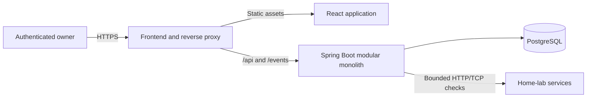
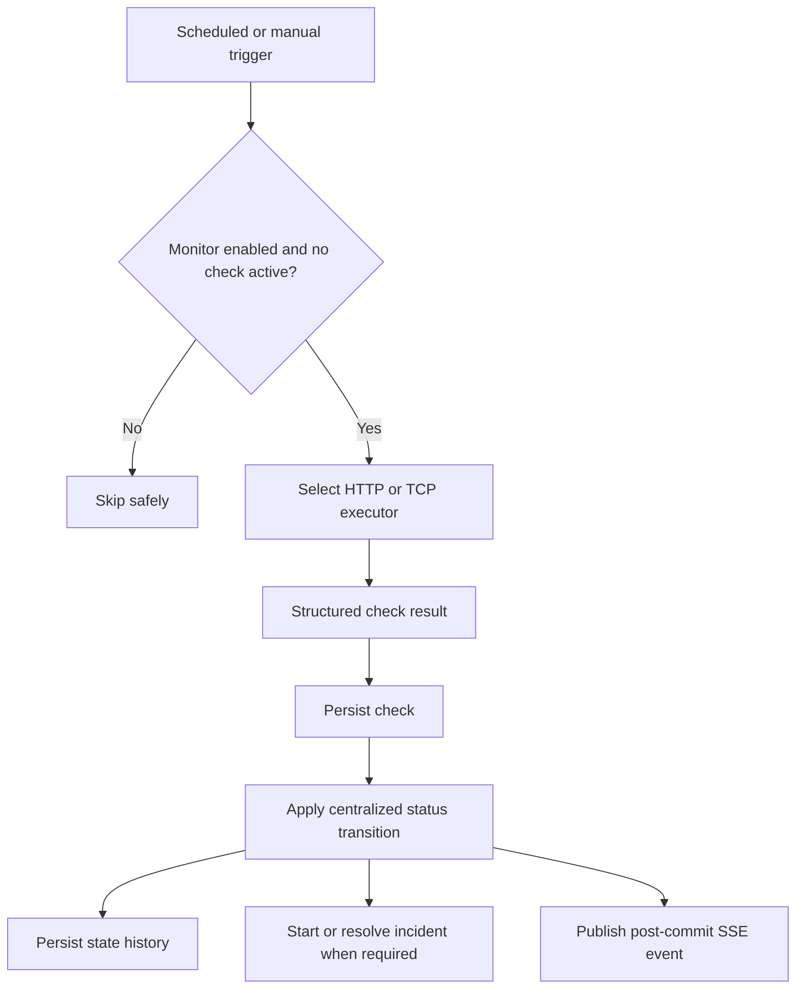

# Architecture

This document records durable constraints and the current design. Sections marked **Planned** are not implemented at the Phase 0 checkpoint.

## System context — planned

HomeLab Monitor is a single-instance modular monolith sized for roughly 100 monitors.

Docker Compose will run the proxy/frontend, backend, and database. Only the proxy/frontend should be public in production; PostgreSQL remains internal.

## Backend module direction — planned

Feature-oriented modules will cover `auth`, `user`, `monitor`, `incident`, `analytics`, `realtime`, and a small `common` area. Modules should expose narrow application-facing services and avoid a mechanical enterprise layering scheme. A notification module must not exist until notifications are implemented.

Controllers exchange DTOs, application services own use-case/transaction boundaries, and persistence entities remain internal. The backend owns all status and incident decisions.

## Monitor execution — planned

Phase 2 must settle the precise locking/serialization mechanism. It must prevent overlap for one monitor without permanent per-monitor threads and preserve correct ordering across manual and scheduled checks, disable/delete, and restart. Prefer a bounded executor and understandable database/application safeguards over distributed coordination.

## State and availability semantics — required

- `ONLINE`: reachable and meets expectations.
- `DEGRADED`: reachable but exceeds the configured latency warning threshold.
- `OFFLINE`: confirmed failed after the failure threshold.
- `PAUSED`: deliberately disabled; excluded from scheduling and uptime.
- `UNKNOWN`: current observation evidence is insufficient; excluded from uptime.

Reachable results reset failure progress. While offline, consecutive reachable results satisfy recovery and resolve to online or degraded based on the latest result. Pausing resolves an active incident as `MONITORING_PAUSED`; normal threshold recovery uses `RECOVERED`. Re-enable always returns to unknown.

Uptime is derived from state durations, never check counts. Online/degraded durations are available, offline durations unavailable, and paused/unknown durations excluded.

## Observation freshness — decision deferred to implementation phase

Phase 5/6 must choose and test a deterministic freshness formula based on interval, timeout, and scheduler tolerance. Reachable state cannot be carried indefinitely after observations stop.

The offline rule needs architecture review because blindly expiring a confirmed outage can hide it, while carrying it through monitor-process downtime can fabricate downtime. The implementation must preserve confirmed incident facts but represent unobserved intervals honestly. The chosen transition and restart reconstruction rules must be documented here before Phase 6 is complete.

## Security boundaries — planned

The owner can intentionally monitor private network services. Therefore target fetching is a privileged feature, not a public URL-preview service.

- Only the authenticated owner may configure or trigger monitors after setup.
- HTTP accepts only `http` and `https`, bounds redirects/body reads/timeouts, and does not persist response bodies.
- TCP validates host, port, and timeout.
- No target input reaches a shell.
- API errors and logs omit secrets and internal exception details.
- Session cookies, CSRF, CORS/same-origin behavior, Actuator exposure, and reverse-proxy headers require dedicated review in Phases 4 and 8.

Private IP addresses remain allowed by design. Documentation and UI must not suggest that untrusted users can safely receive configuration access.

## Data and migrations — planned

PostgreSQL is authoritative. Flyway performs incremental migrations; Hibernate validates rather than creates production schema. State history provides authoritative transition intervals, while checks provide observation and latency detail. Time-window queries are indexed and bounded. Raw checks have configurable scheduled retention.

## Real-time delivery — planned

SSE is preferred because updates are server-to-browser and do not require bidirectional WebSockets. Events should describe current changes rather than replaying large histories. Authentication, reconnection, transaction timing, and cleanup require tests in Phase 7 and a concise ADR when the decision is finalized.

## Decision records

- [ADR-0001: Use a modular monolith](adr/0001-use-a-modular-monolith.md)

Add ADRs only for decisions with meaningful alternatives and consequences.
